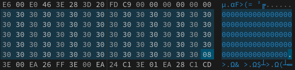
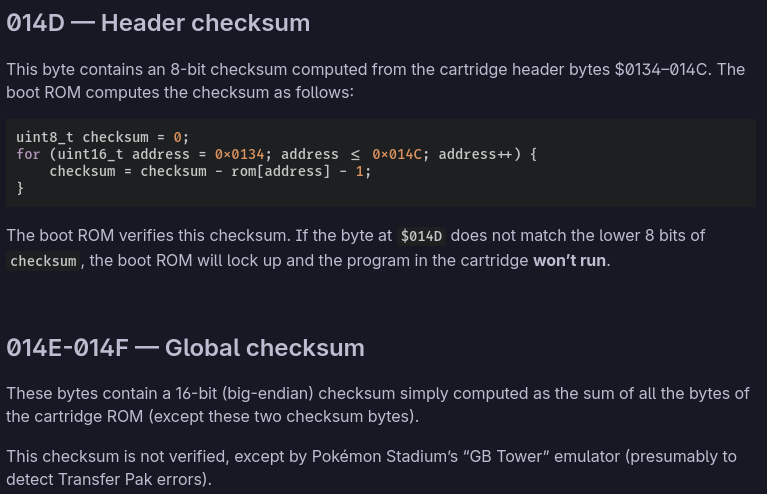
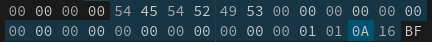

# Gameboy - Medium - 300 Points

## Description du Challenge

### Énoncé

Bien que la plupart des émulateurs sont capables de lire des ROMs ne disposant pas de tous les marqueurs anti contre-façon, certains octets dans certaines positions vont invariablement les faire crasher. Cette ROM a été corrompue, réparez là.

Le flag dans le challenge a le format : blabla(XXX)

### Fournitures

- [chall-medium.gb](./chall-medium.gb)

## Résolution

Ce challenge, dans la continuation du premier, va nous donner un peu plus de fil a retordre car nous allons être obligé de bien comprendre la compositon d'un header afin de le restaurer.

Premièrement, j'ouvre mon fichier, toujours sur [hexed.it](https://hexed.it). Et je me rend au niveau du header :



Ils sont complètements vide. Il va dons nous falloir les ré-écrire. Je relis donc la doc à nouveau sur [The Cartridge Header](https://gbdev.io/pandocs/The_Cartridge_Header.html) et je rempli les différentes parties du header sans trop réfléchir et en me basant sur la ROM du challenge précédent. Puis, je tombe sur cette partie dans la documentation :



Il semblerait que je me sois un peu trop compliqué la tâche. Pour la suite, je décide d'aller au plus simple. C'est à dire de recopier les infos de la cartouche précedente entre le bit `134` et `14C`. Puis ensuite de copier le checksum précédent. Nous obtenons ainsi le header suivant :



Il suffit ensuite de trouver un moyen de lancer notre jeu.

Une rapide recherche sur Google nous permet de trouver le candidat idéal : [bgb](https://bgb.bircd.org/). Il suffit de le lancer avec wine : 

```bash
wine ./bgb64.exe
```

Puis clic droit, `Load ROM` et de séléctionner notre image. Parfait l'image se lance :


Puis, en appuyant sur `S`, nous pouvons avancer dans les menus pour finir par tomber sur le flag !


Il ne reste plus qu'à valider sur la plateforme/

```txt
leHACK{P4P4P!NGO!N}
```
