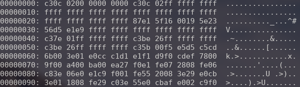

# Tétriste - 100 Points

## Description du Challenge

### Énoncé

Nintendo est connu pour avoir longtemps utilisé le bitmap de son logo comme système de détection des contrefaçons. La GameBoy classic par exemple scannait les 18h premiers octets de la ROM à la recherche de ce bitmap spécifique. La plupart de ces émulateurs lancent le jeu même en l'absence du bitmap.

Le flag est XORé avec une seule lettre majuscule.

### Fournitures

- [chall-easy.gb](./chall-easy.gb)

## Résolution

Le but de ce challenge est donc de retrouver le bitmap du logo de ce jeu, puis de le XOR avec une lettre majuscule pour obtenir le flag.

Premièrement, observons le fichier auquel nous avons affaire.

```bash
xxd chall-easy.gb | head 
```



Il s'agit visiblement d'un fichier binaire qui correspond à une cartouche de GameBoy. Nous devons donc trouver l'offset sur lequel récupérer les valeurs des bits du logo.

Un rapide tour sur Google nous permet de trouver [The Cartridge Header](https://gbdev.io/pandocs/The_Cartridge_Header.html), un site qui explique comment est composé le header d'une cartouche nintendo.

Le bitmap du logo se trouve entre les bits `0104` et `0133` du header.

> [!WARNING]
> Le site ne le précise pas explicitement, les adresses sont données en hexa et non en décimal, cette erreur m'aura fait perdre une vingtaine de minutes.

Pour extraire les bits, j'ai choisi d'utiliser [hexed.it](https://hexed.it) qui me permet de visualier en entier le fichier. J'ai ensuite pu séléctionner et exporter les bits dans un fichier txt.

```bash
00000000: 0000 0000 0000 0000 0000 0000 0000 0000  ................
00000010: 242d 0009 0b03 330f 7c25 7b2a 7831 170d  $-....3.|%{*x1..
00000020: 293b 3117 0e24 7c2f 3500 0000 0000 0000  );1..$|/5.......
```

Ensuite, il m'a suffit d'écrire un script pour bruteforce le xor, et avec un peu d'aide de LLM.

```python
# Read the content of the file as binary
file_path = './bits_logo.txt'
with open(file_path, 'rb') as file:
    input_bytes = file.read()

# Define the capital letters A-Z in bytes
capital_letters = [ord(letter) for letter in "ABCDEFGHIJKLMNOPQRSTUVWXYZ"]

# Function to convert bytes to UTF-8 characters, handling errors
def bytes_to_utf8(byte_list):
    return bytes(byte_list).decode('utf-8', errors='replace')

# Perform XOR operation between the table of bytes and each capital letter
resulting_tables = {}
for letter in capital_letters:
    resulting_table = [byte ^ letter for byte in input_bytes]
    resulting_tables[chr(letter)] = bytes_to_utf8(resulting_table)


# Print the resulting tables
for letter, result in resulting_tables.items():
    print(f"Resulting table after XOR with '{letter}': {result}")
```

Puis après éxécution :

```bash
python3 unxor.py
Resulting table after XOR with 'A': AAAAAAAAAAAAAAAAelAHJBrN=d:k9pVLhzpVOe=ntAAAAAAA
[...]
Resulting table after XOR with 'H': HHHHHHHHHHHHHHHHleHACK{G4m3b0y_Easy_Fl4g}HHHHHHH
[..]
Resulting table after XOR with 'Z': ZZZZZZZZZZZZZZZZ~wZSQYiU&!p"kMWsakMT~&uoZZZZZZZ
```

Parfait ! Avec la `H`, nous trouvons le flag :

```txt
leHACK{G4m3b0y_Easy_Fl4g}
```
